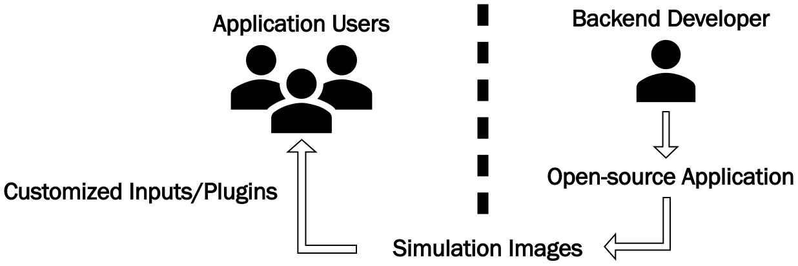
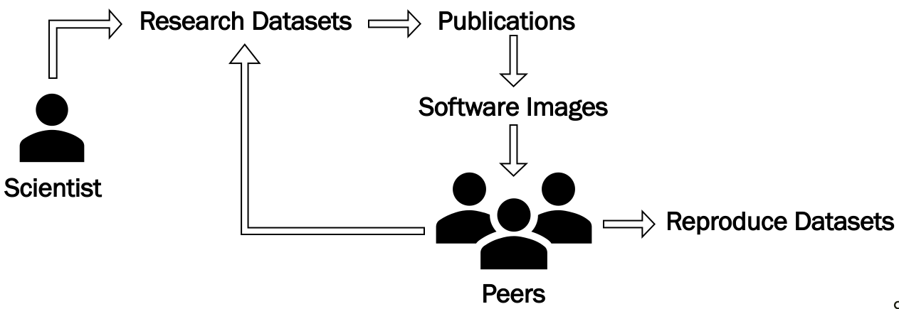

.. |icon| image:: ./media/icon.svg
  :width: 30
  
============  
|icon| Maple
============

|Code style: black|

|BubbleBox| |FlashX| |FlowX| |Minimal|

Maple is a productivity tool that acts a wrapper around docker, podman, and singularity containerization services to provide a seamless interface to deploy High Performance Computing (HPC) applications on cloud and supercomputing platforms. It provides a python based library and command line interface to manage developer and production environment for running complex multiphysics simulations.

Open-source tools for numerical simulation of partical engineering problems provide state-of-art methods and techniques, and undergo continous development for accuracy and performance on modern computing architectures. Accessibility of these tools for core industry users has been a challenge due to the presence of complexities associated with setting up desired problems with external dependencies. Consider the problem illustrated below where a backend developer for an open-source simulation tool manages/creates images for application users, who in turn can customize it for their specific use case. Maple can be used to manage/deploy this workflow.

|fig1|

Another important aspect that Maple aims to address is the reproducibility in research and development. As illustrated below, a scientist can publish software images using Maple to allow their peers to: (1) Reproduce their research datasets (2) Work with existing datasets to gain more insight. Maple aims to make the process of publishing/use of images organized and systematic.

|fig2|
    
Tutorial
========

The link below provides an overiew of Maple within the context of Flash-X (https://flash-x.org), a multiphysics simulation software instrument. Some of the details maybe be outdated, but we are working on updating the tutorial.

|Tutorial|

Installation
============

Stable releases of Maple are hosted on Python Package Index website (`<https://pypi.org/project/PyMaple/>`_) and can be installed by executing,

::

   pip install PyMaple
   
Note that ``pip`` should point to ``python3+`` installation package ``pip3``. 

Upgrading and uninstallation is easily managed through this interface using,

::

   pip install --upgrade PyMaple
   pip uninstall PyMaple

There maybe situations where users may want to install Maple in development mode $\\textemdash$ to design new features, debug, or customize options/commands to their needs. This can be easily accomplished using the ``setup`` script located in the project root directory and executing,

::

   ./setup develop

Development mode enables testing of features/updates directly from the source code and is an effective method for debugging. Note that the ``setup`` script relies on ``click``, which can be installed using,

::

  pip install click

The ``maple`` script is installed in ``$HOME/.local/bin`` directory and therfore the environment variable, ``PATH``, should be updated to include this location for command line use.

Dependencies
============

``click`` ``toml`` ``docker`` ``singularity`` ``podman``

Writing a Maplefile
===================

Maplefile is a TOML configuration file that is placed in a project root directory. Location of the Maplefile marks the directory which will be mounted inside container,

::

  $ tree Flash-X
  
  ├── bin 
  ├── docs  
  ├── LICENSE
  ├── NOTICE
  ├── RELEASE
  ├── sites
  ├── tools
  ├── container
  ├── lib
  ├── Maplefile
  ├── README.md
  ├── setup
  ├── source

The example above shows the directory tree for Flash-X, which contains a Maplefile along with files/folders that comprise the project. The corresponding Maplefile looks like,

.. code-block:: python
  
  # Maplefile for Flash-X

  # Base Image
  base = "akashdhruv/amrex:ppc64le"

  # Platform
  platform = "linux/ppc64le"

  # Name of the container/image
  container = "flashx"

  # MPI path from host
  mpi = "/path/to/host/mpi"

  # Commands for building local image
  # from base image, and installing dependencies
  build = [
    "dnf install <packages>", 
    "pip install <python-packages>", 
  ]

  # Commands to execute inside the container
  # using the current mount directory and
  # update the local image
  publish = [
    "./setup <simulation> <options>", 
    "make && cp <app> </path/inside/image>", 
  ]

  # Backend for service
  # docker/singularity/podman
  backend = "podman"
  
Image versus Container
======================

Following is how Maple differentiates between an Image and a Container:

- Image

    Blueprint for running containers, provides environment to work with code/data in working directory

- Container

    Instance of an image

    Interacts with an image by mounting data/code from working directory

    Writes data to working directory when running applications from an image

    Updates an image using data/code from working directory

Usage
=====

- Build a local image from base image

    ``maple image build --base=<image-name>``
- Activate local container from an image

    ``maple container pour --image=<image-name>``
- Step inside container shell

    ``maple container shell``
    
- Save changes from a local container to an image

    ``maple container commit --image=<image-name>`` 

- Stop and delete local container

    ``maple container rinse``

- Prune redundant layers from a local image (reduce size)

    ``maple image squash --image=<image-name>``

- Launch an ipython notebook inside the container

    ``maple container notebook --image=<image-name> --port=<port-id>``

- Run commands inside the container

    ``maple container run --image=<image-name> "echo Hello World!"``

- Delete containers

    ``maple container rinse <container1> <container2> <container3>``

- Delete images

    ``maple image delete <image1> <image2> <image3>``

-  Remote interface 

    ``maple pull <image-name>``
    
    ``maple push <image-name>``

.. |Code style: black| image:: https://img.shields.io/badge/code%20style-black-000000.svg
   :target: https://github.com/psf/black
   
.. |BubbleBox| image:: https://github.com/akashdhruv/Maple/workflows/BubbleBox/badge.svg
.. |FlashX| image:: https://github.com/akashdhruv/Maple/workflows/FlashX/badge.svg
.. |FlowX| image:: https://github.com/akashdhruv/Maple/workflows/FlowX/badge.svg
.. |Minimal| image:: https://github.com/akashdhruv/Maple/workflows/Minimal/badge.svg

.. |Tutorial| image:: http://img.youtube.com/vi/gNmVtj7-RBY/0.jpg
   :target: http://www.youtube.com/watch?v=gNmVtj7-RBY
   

    

.. |nbsp|   unicode:: U+00A0 .. NO-BREAK SPACE
